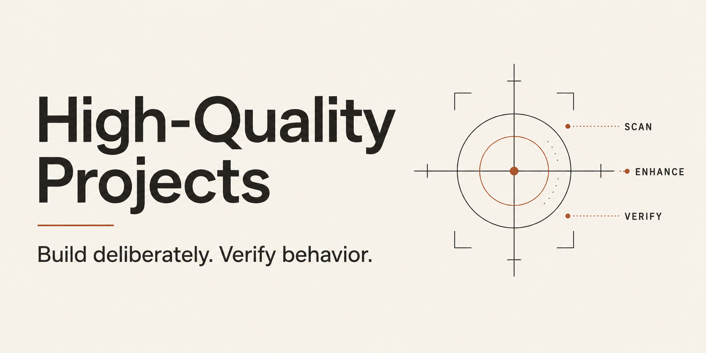

<p align="center">
  <a href="https://github.com/RandyNorthrup/high-quality-projects-skill/actions/workflows/cross-platform.yml"></a>
  <a href="https://github.com/RandyNorthrup/high-quality-projects-skill/releases"></a>
  <a href="LICENSE"></a>
</p>

<p align="center">
  <a href="#installation">Install</a> ·
  <a href="#workflows">Workflows</a> ·
  <a href="#delivery-with-evidence">Delivery</a> ·
  <a href="#reference-tooling">Tooling</a> ·
  <a href="#documentation">Docs</a>
</p>

# Build on what exists. Prove what works.

Three vendor-neutral workflows for coding agents: discover a project, deliver a
feature, or improve an existing codebase. Each starts with a scan, enhances the
canonical implementation, and verifies that tests reject real defects.

**Readable instructions. First-party delivery tools. Project-local changes.**
Use the whole package with your coding agent; Claude Code, Cursor, and Copilot
adapters provide optional discovery.

## Workflows

| Your task | Start here |
|---|---|
| **Turn an idea into a project** | [`project_setup`](skills/project_setup/SKILL.md) — focused discovery, confirmed brief, stack selection, scaffolding, and quality gates. |
| **Deliver a feature in an existing project** | [`feature_delivery`](skills/feature_delivery/SKILL.md) — scoped requirements, acceptance criteria, task ownership, implementation, red drills, and verified closeout. |
| **Raise an existing codebase's standards** | [`quality_retrofit`](skills/quality_retrofit/SKILL.md) — baseline first, then reviewable phases for configuration, formatting, lint, types, dead code, security, and docs. |

### Start with intent

```text
Use project_setup. Grill me on a local invoice application before choosing its stack.

Use feature_delivery. Add CSV export to the existing report flow; preserve its API.

Use quality_retrofit. Strengthen the existing Python gates and prove they fail.
```

Setup reuses known answers and asks about decisions that affect the product:
users, outcomes, scope, accessibility, brand, data, security, distribution,
signing, operations, and release. A confirmed `PROJECT_BRIEF.md` precedes stack
selection. Existing features use focused discovery for the requested change.

Retrofit follows independently reviewable phases and preserves stricter existing
configuration. User-authorized scope determines which phases apply; unavailable
or deferred checks remain explicit.

## Installation

Stable release: **[v0.6.0](https://github.com/RandyNorthrup/high-quality-projects-skill/releases/tag/v0.6.0)**.

### Any coding agent

```console
git clone --branch v0.6.0 --depth 1 https://github.com/RandyNorthrup/high-quality-projects-skill.git
```

Point the agent at [`AGENTS.md`](AGENTS.md), then the selected workflow in full.
Keep the repository together: skills use shared scripts, templates, references,
and assets. See the [installation guide](docs/INSTALLATION.md) for Codex
registration, pinned installs, archive checksums, provenance, and updates.

### Claude Code

```text
/plugin marketplace add RandyNorthrup/high-quality-projects-skill
/plugin install high-quality-projects-skill@high-quality-projects-skill
/reload-plugins
```

Invoke `/high-quality-projects-skill:project_setup`,
`/high-quality-projects-skill:feature_delivery`, or
`/high-quality-projects-skill:quality_retrofit`.

<details>
<summary><strong>Native shells and requirements</strong></summary>

Windows uses PowerShell 5.1 or newer; Bash and WSL are unnecessary. Linux and
macOS use Bash and standard POSIX tools. Git supports checkout and source checks.
Delivery helpers require **Python 3.12+**, with no additional Python packages.
The separate Python formatting helper requires Python 3.

Resolve the package root before using workflow paths:

```powershell
$SkillRoot = & 'C:\path\to\high-quality-projects-skill\scripts\skill-root.ps1'
& "$SkillRoot\scripts\detect-stack.ps1" .
```

```bash
SKILL_ROOT="$(bash /path/to/high-quality-projects-skill/scripts/skill-root.sh)"
bash "$SKILL_ROOT/scripts/detect-stack.sh" .
```

The scanners inventory existing code, configuration, Git state, and available
tools. Inspect their JSON for `error`; exit zero means the JSON contract was
returned. Individual quality gates need their own project tools. Scanning
installs nothing.

</details>

## Delivery with evidence

**Discover → establish readiness → implement → verify → reconcile → resume.**

One canonical `PLAN.md` carries human-readable decisions and a versioned JSON
ledger. Stable IDs connect requirements, acceptance criteria, tasks, and proof.
Existing plans are extended; a second competing tracker is unnecessary.

| Capability | What it checks |
|---|---|
| **Readiness** | Required decisions, acceptance coverage, task ownership, dependencies, and current review receipts. |
| **Verification** | Recorded behavior and red-drill evidence, actual file outcomes, artifact hashes, source inputs, and environment bindings. |
| **Reconciliation** | Unmet criteria return to their existing task owner; unchanged input does not generate duplicate work. |
| **Resume** | Checkpoints expose changed inputs, stale evidence, and unresolved external outcomes before work continues. |
| **Atomic updates** | Candidate validation, observed-digest preconditions, cooperative locking, and atomic replacement preserve the last complete plan. |

```console
python scripts/verify-delivery.py --observe-context
python scripts/verify-delivery.py --root /path/to/project --plan PLAN.md --stage closure --context context.json
```

Run these from the package checkout. Save the observed context in the target
project and extend it with independently observed tool versions. The
[delivery guide](docs/DELIVERY.md) documents the complete lifecycle, schema,
commands, and [native plan asset](templates/workflow/PLAN.md).

The validator checks structure and recorded evidence. Semantic review and real
tests establish whether the product meets its requirements. A copied template,
a fabricated log, or a green structural report cannot establish that on its own.
Recorded command strings are never executed by the validator or update helper.

## Design principles

**Scan and enhance.** Trace existing responsibilities, consumers, tests, assets,
and configuration before adding a path. Extend canonical work; review for
semantic duplication again at closeout.

**Prove the test can fail.** Every project maintains [red drills](docs/RED-DRILLS.md):
green baseline, intentional defect, the intended nonzero failure, exact
restoration, then green again. Repeat affected drills when code, tests, tools,
or configuration change and run the maintained set at release verification.
Zero tests, unrelated crashes, and warning-only output earn no credit.

**Verify effects.** Check observable behavior with independent expected results.
Reject self-comparisons, assertions that merely mirror implementation, vacuous
success paths, and placeholders presented as finished work.

**Keep evidence honest.** Distinguish implemented from verified. Record failures,
deferred gates, scope changes, and environment limits. Preserve user edits and
observe uncertain external outcomes before retrying an operation.

**Use current language guidance.** Review ownership, resource lifetimes,
asynchronous errors, semantics, accessibility, and organization alongside static
gates. Automated fixes remain code changes that require review.

## Reference tooling

Select tools for the actual project and verify compatibility. Supplied templates
are starting points to extend existing configuration; they do not establish
compliance by being copied.

| Language / surface | Reference gates |
|---|---|
| Python | Ruff, mypy, vulture, deptry, Bandit, pip-audit; project tests |
| TypeScript / JavaScript | Prettier, ESLint, TypeScript, knip, dpdm, npm audit, Semgrep |
| Rust | rustfmt, Clippy, compiler, cargo-machete, cargo-audit, cargo-deny, cargo test |
| C / C++ | clang-format, clang-tidy, cppcheck, compiler, separate sanitizer builds |
| C# / .NET | dotnet format, analyzers, nullable checks, warnings as errors, NuGet audit, dotnet test |
| HTML / CSS | Semantic and accessibility review, HTMLHint, Stylelint, Prettier |
| PowerShell / Shell | PSScriptAnalyzer / ShellCheck and shfmt; project tests |
| Go | gofmt, go vet, selected Staticcheck, govulncheck, go test, race/fuzz checks where supported |

Go has guidance rather than a supplied configuration template. Cross-cutting
references cover Gitleaks, Semgrep, and jscpd. See the
[language review contract](docs/CODE-QUALITY.md) for primary sources and the
[template index](templates/README.md) for configuration details and compatibility.

## Documentation

| Read | For |
|---|---|
| [Agent entry point](AGENTS.md) | Workflow routing and shared invariants |
| [Installation](docs/INSTALLATION.md) | Registration, updates, checksums, and provenance |
| [Delivery](docs/DELIVERY.md) | Native ledger, readiness, reconciliation, and resume |
| [Red drills](docs/RED-DRILLS.md) | Reproducible failure and restoration procedures |
| [Code quality](docs/CODE-QUALITY.md) | Common and language-specific review rules |
| [Discovery questions](skills/project_setup/references/grill-me.md) | Product and delivery decisions |
| [Philosophy](docs/PHILOSOPHY.md) | Why gates exist and when strictness becomes counterproductive |
| [Verification record](docs/QUALITY-REVIEW.md) | Dated evidence and its limits |
| [Contributing](CONTRIBUTING.md) | Local checks, behavioral trials, and release procedure |
| [Changelog](CHANGELOG.md) | Released changes |

<details>
<summary><strong>Package layout</strong></summary>

```text
skills/       three workflow entry points and focused resources
scripts/      native inventory, delivery validation, atomic updates, release tools
templates/    language configurations and the native plan asset
tests/        deterministic checks, red drills, and isolated behavioral fixtures
docs/         shared contracts, primary sources, and verification evidence
```

</details>

[MIT licensed](LICENSE). If this saves you time,
[support the project via PayPal](https://www.paypal.com/donate/?hosted_button_id=Q9VC7B42R7K82).
